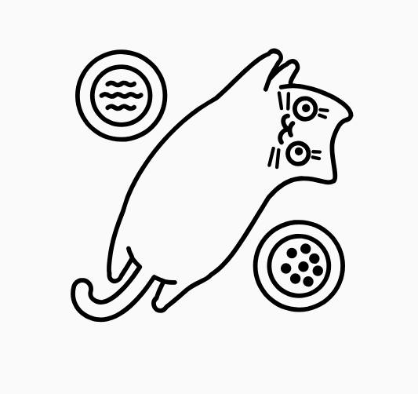

# CAT  
C# abstract types - dotnetstandard 1.0  

## Option
simulates maybe type with inheritance

## Result
tries to implement Choice/Either type, strict has more static "strictness",  
wheras Loose is more dynamic (using interface inheritance polymorphism)

### Status

